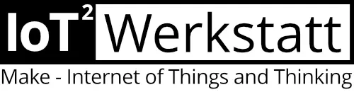

  

# IoT²-Werkstatt – Ardublock

Dieses Repository ist Teil der **IoT²-Werkstatt**, einer offenen Bildungsinitiative für Maker, Schulen, Lernende und Lehrkräfte.
Ziel ist es, kreative, experimentelle und alltagsnahe Zugänge zu **Elektronik**, **Programmierung** und dem **Internet of Things and Thinking (IoT²)** zu ermöglichen.

Weitere Informationen, Unterrichtsmaterialien und Projekte auf der Homepage am Umwelt-Campus Birkenfeld der Hochschule Trier
👉 https://www.iot-werkstatt.de

---

## 📦 Komponenten & Lizenzen

Dieses Repository kombiniert zwei voneinander unabhängige Open-Source-Projekte, die jeweils ihre eigene Lizenz behalten:

### 📁 `ardublock/` – GNU GPLv3  
Ein Fork von **ArduBlock**, einer grafischen Block-Programmieroberfläche für Arduino.  
- Lizenz: **GNU General Public License v3 (GPLv3)**  
- Datei: `ardublock/LICENSE`

### 📁 `openblocks/` – MIT License  
Ein Fork von **OpenBlocks**, einem Framework für visuelle Block-Programmierung.  
- Lizenz: **MIT License**  
- Datei: `openblocks/LICENSE`

### Hinweis zu den Lizenzen  
Da beide Komponenten **unterschiedliche Lizenzen** besitzen, wird im Repository-Root **keine gemeinsame LICENSE-Datei** geführt.  
Bitte beachten Sie die jeweilige Lizenz im entsprechenden Unterordner.

---

# English Version

## IoT² Workshop – Ardublock

This repository is part of the **IoT²-Werkstatt**, an open educational initiative for maker, students, teachers, and schools.
Its mission is to provide creative, hands-on access to **electronics**, **programming**, and the **Internet of Things (IoT)**.

More information and teaching materials see homepage at Umwelt-Campus Birkenfeld, Trier University of Applied Sciences

👉 https://www.iot-werkstatt.de

---

## 📦 Components & Licenses

This repository combines two independent open-source projects that each retain their own license:

### 📁 `ardublock/` – GNU GPLv3  
A fork of **ArduBlock**, a graphical block-based programming environment for Arduino.  
- License: **GNU General Public License v3 (GPLv3)**  
- File: `ardublock/LICENSE`

### 📁 `openblocks/` – MIT License  
A fork of **OpenBlocks**, a framework for visual block editing.  
- License: **MIT License**  
- File: `openblocks/LICENSE`

### Licensing Note  
Because the components use **different licenses**, there is **no unified LICENSE file** in the project root.  
Refer to the LICENSE files inside each component folder.

---
