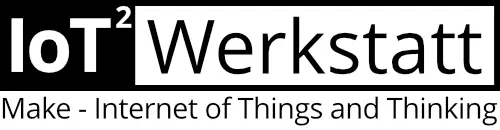

  

# IoT²-Werkstatt – Ardublock

Dieses Repository ist Teil der **IoT²-Werkstatt**, einer offenen Bildungsinitiative für Maker, Schulen, Lernende und Lehrkräfte.
Ziel ist es, kreative, experimentelle und alltagsnahe Zugänge zu **Elektronik**, **Programmierung** und dem **Internet of Things and Thinking (IoT²)** zu ermöglichen.

Weitere Informationen, Unterrichtsmaterialien und Projekte auf der Homepage am Umwelt-Campus Birkenfeld der Hochschule Trier
👉 https://www.iot-werkstatt.de

Installations Bundle mit Arduino-IDE "ready to play" (Windows und Linux)  
👉 https://github.com/klausgollmer/IoT-Werkstatt-IoTW-Bundle

---

## 📦 Komponenten & Lizenzen

Dieses Repository kombiniert zwei voneinander unabhängige Open-Source-Projekte, die jeweils ihre eigene Lizenz behalten:

### 📁 `ardublock/` – GNU GPLv3  
Dieses Projekt nutzt **ArduBlock**, eine grafische Block-Programmieroberfläche für Arduino.  
- David Li and He Qichen
- Repository https://github.com/taweili/ardublock
- Lizenz: **GNU General Public License v3 (GPLv3)**  
- Datei: `ardublock/LICENSE`

### 📁 `openblocks/` – MIT License  
Dieses Projekt nutzt **OpenBlocks**, einem Framework für visuelle Block-Programmierung.
- Eric Klopfer, Daniel Wendel, Ricarose Roque, Corey McCaffrey, Lunduo Ye, Aidan Ho, Brett Warne, Xudan Liu, Hout Nga, Mikael Gueck, David Li, Philippe Cade, Tony Graham
- Repository: https://github.com/mikaelhg/openblocks
- Lizenz: **MIT License**  
- Datei: `openblocks/LICENSE`

### Hinweis zu den Lizenzen  
Da beide Komponenten **unterschiedliche Lizenzen** besitzen, wird im Repository-Root **keine gemeinsame LICENSE-Datei** geführt.  
Bitte beachten Sie die jeweilige Lizenz im entsprechenden Unterordner.

### Schnellstart und Installationsanleitung  
- https://www.umwelt-campus.de/iot-werkstatt/tutorials/schnellstart-makey

# Autor
Klaus-Uwe Gollmer  
- Anpassung Oberfläche
- Codegenerator und Setup der IoT²-Funktionen für ESP8266 und ESP32
 
---

# English Version

## IoT² Workshop – Ardublock

This repository is part of the **IoT²-Werkstatt**, an open educational initiative for maker, students, teachers, and schools.
Its mission is to provide creative, hands-on access to **electronics**, **programming**, and the **Internet of Things and Thinking (IoT²)**.

More information and teaching materials see homepage at Umwelt-Campus Birkenfeld, Trier University of Applied Sciences

👉 https://www.iot-werkstatt.de

---

## 📦 Components & Licenses

This repository combines two independent open-source projects that each retain their own license:

### 📁 `ardublock/` – GNU GPLv3  
**ArduBlock**, a graphical block-based programming environment for Arduino.  
- David Li and He Qichen
- Repository https://github.com/taweili/ardublock
- License: **GNU General Public License v3 (GPLv3)**  
- File: `ardublock/LICENSE`

### 📁 `openblocks/` – MIT License  
**OpenBlocks**, a framework for visual block editing.  
- Eric Klopfer, Daniel Wendel, Ricarose Roque, Corey McCaffrey, Lunduo Ye, Aidan Ho, Brett Warne, Xudan Liu, Hout Nga, Mikael Gueck, David Li, Philippe Cade, Tony Graham
- Repository: https://github.com/mikaelhg/openblocks
- License: **MIT License**  
- File: `openblocks/LICENSE`

### Licensing Note  
Because the components use **different licenses**, there is **no unified LICENSE file** in the project root.  
Refer to the LICENSE files inside each component folder.

### Install and Quickstart  
- https://www.umwelt-campus.de/iot-werkstatt/tutorials/schnellstart-makey
- change language in preferences arduino-ide 

# Author
Klaus-Uwe Gollmer
- Adaption GUI
- Code generator and IoT² functions for ESP8266 and ESP32
---
